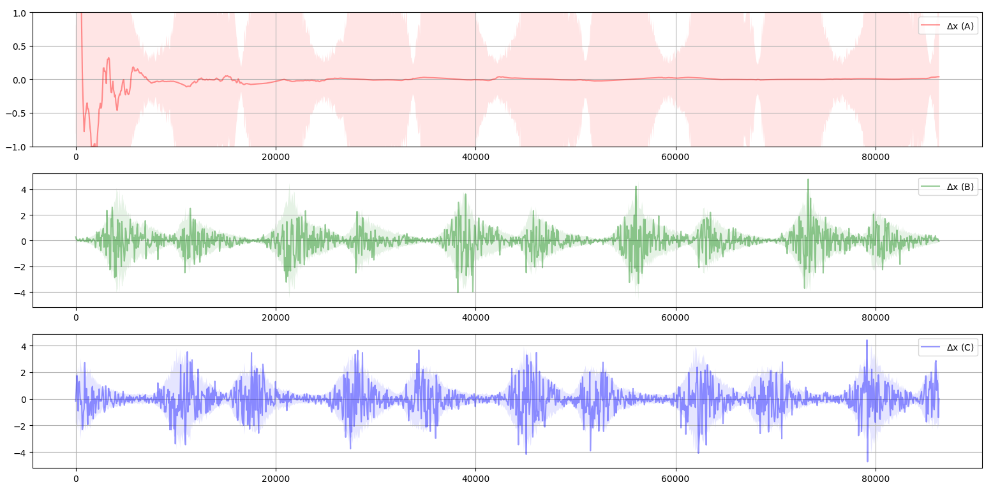
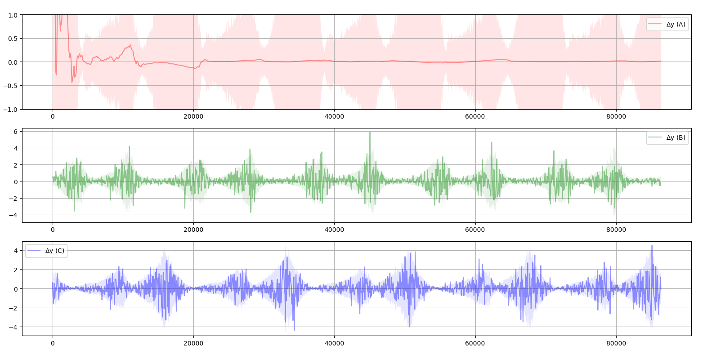
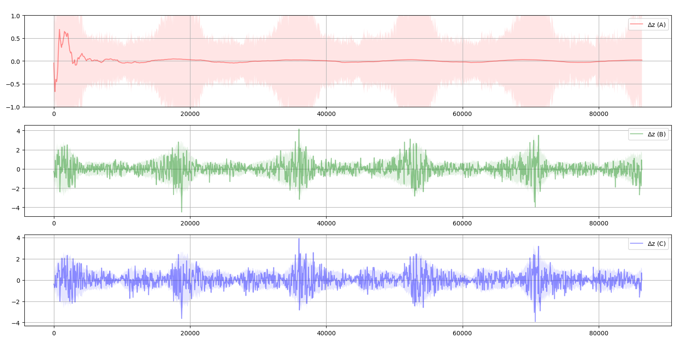
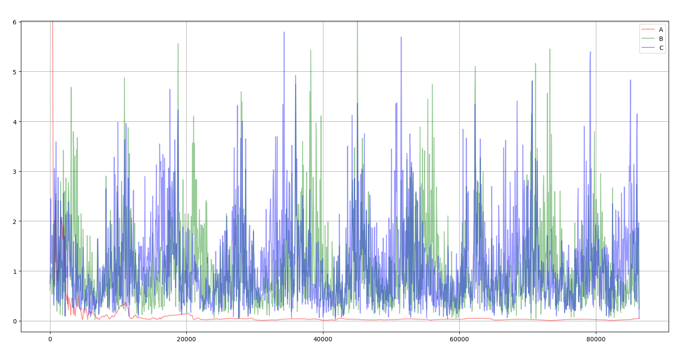
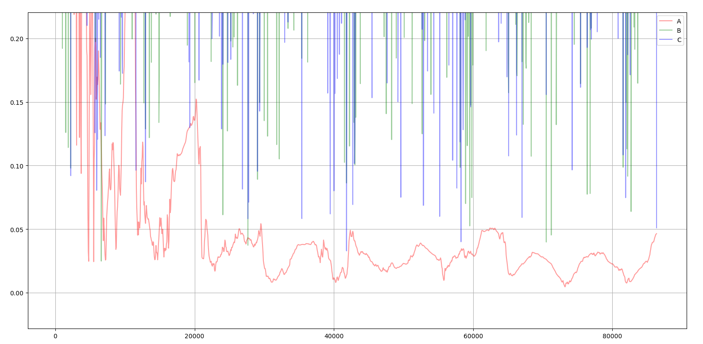

# orbit-est-projection-mkf
 
Satellite Orbit Estimation using a projection based modified Kalman Filter.  
 
The standard Kalman filter is updated with a modified measurement equation which eliminates unwanted observables in the filter state by projection along a hyperplane. The resulting equation is also observable and has all convergence properties of the standard Kalman Filter. The primary advantage is the reduction of noise in the mesaurement update equation which in turn results in faster convergence.  
Related work : Schmidt Kalman Filter 
 
Estimation Error along X,Y,Z for three satellite in geo sync orbit. 
Satellite A (Red) : Filter enabled. Satellite B(green) C(blue): Filter disabled
  

Root Sum Square Error , three satellites  

 

